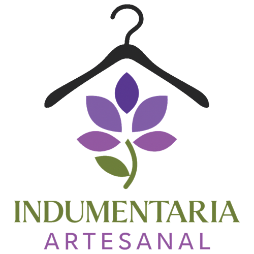

# Sistema de Gestión de Ventas y Productos - Indumentaria

Este proyecto es un sistema para la **gestión interna de un comercio de ropa**, diseñada para facilitar las tareas diarias y centralizar la administración de compras, productos, descuentos y cierre de caja.

## Funcionalidades principales

El sistema cuenta con un **menú principal** que permite acceder a las siguientes opciones:

- **Agregar compra:** registrar nuevas compras realizadas por clientes.  
- **Ver compras:** consultar el historial de compras almacenadas.  
- **Productos:** administrar el catálogo de productos disponibles en el comercio.  
- **Descuentos:** aplicar y gestionar descuentos sobre productos o compras.  
- **Cierre de caja:** generar un resumen final de ventas y movimientos de dinero del día.  

## Objetivo

El objetivo del proyecto es ofrecer una herramienta simple y eficiente para:

- Organizar la información de ventas y productos.  
- Agilizar el registro de compras y descuentos.  
- Llevar un control básico de caja al final de la jornada.

### Ejemplo del programa
https://www.figma.com/proto/k992rliiPGuvynTgM2LcmQ/IA-inteligencia-artesanal-?node-id=2-1345&p=f&t=i3LD58tTaIAQxRGv-1&scaling=scale-down&content-scaling=fixed&page-id=0%3A1&starting-point-node-id=2%3A1345&show-proto-sidebar=1